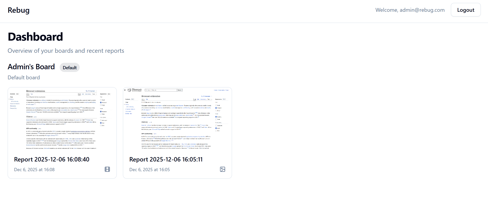
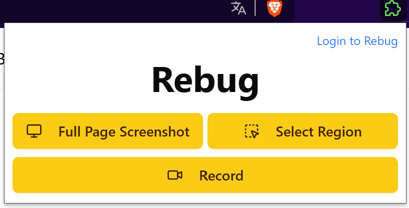
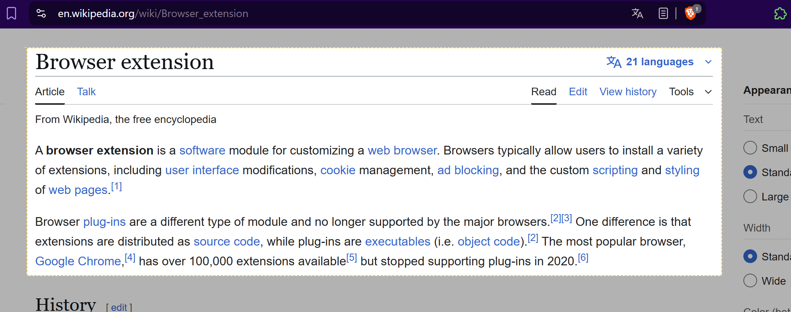
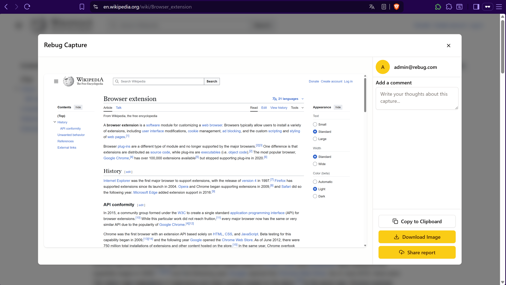
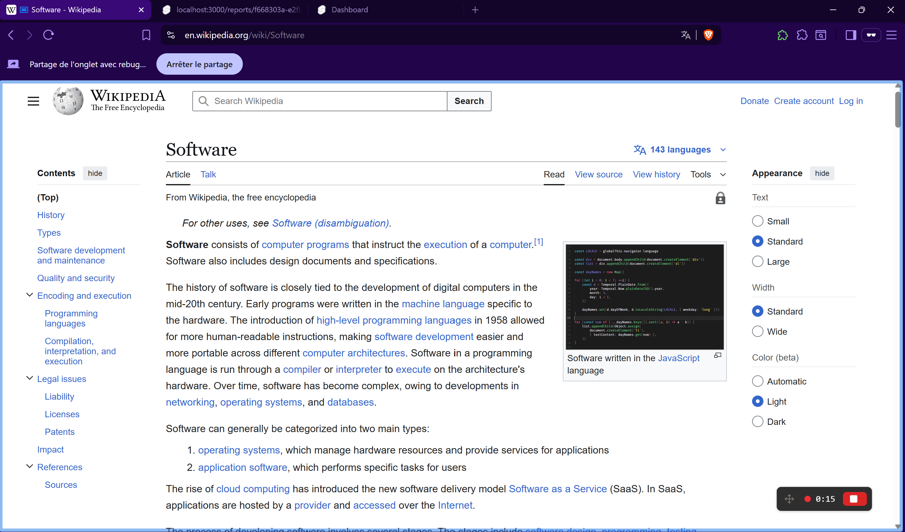
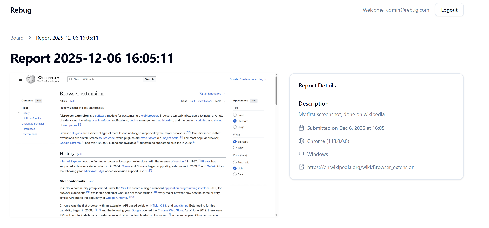

# Rebug

A Chrome extension and web app for capturing screenshots and videos with all the context you need for bug reporting. No more "what browser were you using?" back-and-forth.



## Why?

After discovering [Jam.dev](https://jam.dev/), I loved their approach to bug reporting: just click a button and everything gets captured with context. I wanted to build something similar to understand how it all works under the hood. This is the result.

## What it does

Rebug lets you capture screenshots or record videos, automatically collects page context (URL, browser, OS), and optionally uploads everything to a central server for team collaboration.

The browser extension works completely offline if you want—just save locally. Or authenticate to upload reports to the web dashboard.

## Features

### Screenshot capture



Two modes: capture the full visible page instantly, or select a specific region.

The region selector lets you drag to select exactly what you want to capture, perfect for highlighting specific UI issues.



After capturing, a modal appears with options:



- Copy to clipboard
- Download locally
- Upload to your dashboard (when authenticated)

### Video recording



Click record and Chrome's native screen picker lets you choose a tab, window, or entire screen. Recording controls appear on the page so you can stop when ready.

The extension handles all the tricky parts: WebM encoding, duration metadata fixes (browsers don't always set it correctly), and automatic thumbnail generation from the first frame.

### Reports with context



Every capture includes metadata:
- Page URL
- Browser version
- Operating system
- Timestamp

You can add a title and description, then upload to a board. This context is crucial for reproducing bugs.

### Web dashboard

All uploaded reports land in your dashboard, organized by boards. Think of boards as projects or features.

Videos play on hover for quick previews, and clicking any report shows the full details with all metadata.

## Tech stack

Built as a monorepo with two main parts:

**Extension** (`/web-extension`):
- [WXT](https://wxt.dev/) - Modern extension framework
- Svelte 5 + TypeScript
- Tailwind CSS
- Shadow DOM for UI injection to avoid conflicts with host pages
- Offscreen document for video recording (Manifest V3 requirement)

**Server** (`/server`):
- Rust backend with Axum and SQLite
- SvelteKit frontend
- Clean architecture with separate layers
- Type safety everywhere—Rust generates TypeScript types automatically

## Getting started

### Extension

```bash
cd web-extension
pnpm install
pnpm dev        # Chrome development mode
pnpm build      # Production build
```

Load the extension from `web-extension/.output/chrome-mv3` in Chrome.

### Server

```bash
cd server

# Backend
cargo run

# Frontend (in another terminal)
cd frontend
pnpm install
pnpm dev
```

The server runs on `http://localhost:3000` by default.

## How it works

The extension works offline by default. Authentication is optional and enables server sync.

**Offline mode**: Screenshots and videos are saved directly to your computer.

**Online mode**: After logging in, captures can be uploaded to your dashboard with all metadata. Reports are organized by boards for easy management.

## Browser support

Fully functional on Chrome/Chromium. 

Firefox support is incomplete due to differences in Manifest V3 implementation and extension APIs. Testing and optimization are focused on Chrome.

## Project structure

```
rebug/
├── web-extension/     # Browser extension
│   ├── entrypoints/   # Extension entry points (popup, background, content)
│   ├── components/    # Svelte UI components
│   └── utils/         # Helper functions
└── server/
    ├── src/           # Rust backend
    │   ├── api/       # HTTP routes
    │   ├── domain/    # Business logic
    │   └── application/ # Services
    └── frontend/      # SvelteKit app
        └── src/
            ├── routes/  # Pages
            └── lib/     # Components and utilities
```

## What's next

The core features work well, but there's room for growth:
- Full Firefox support
- Collaborative annotations
- Team workspaces
- Advanced search
- Integrations with tools like Jira or GitHub
- Console log capture
- Network request capture

For now, it's a solid tool for visual bug reporting with automatic context capture.

## License

MIT
